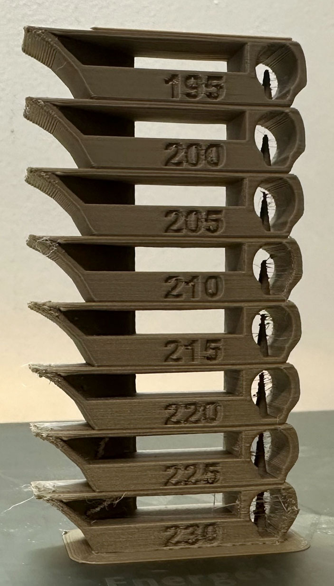
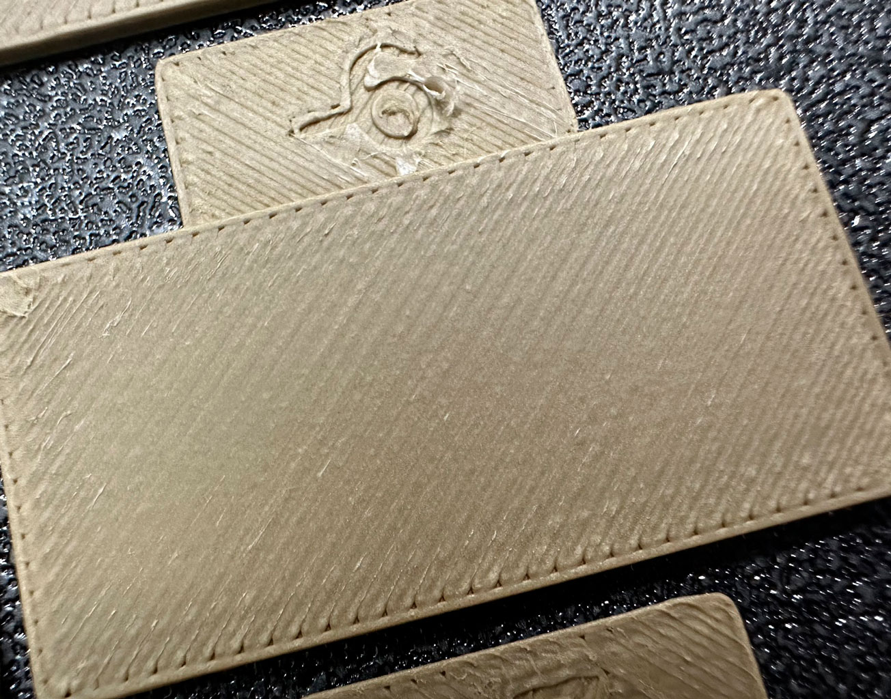
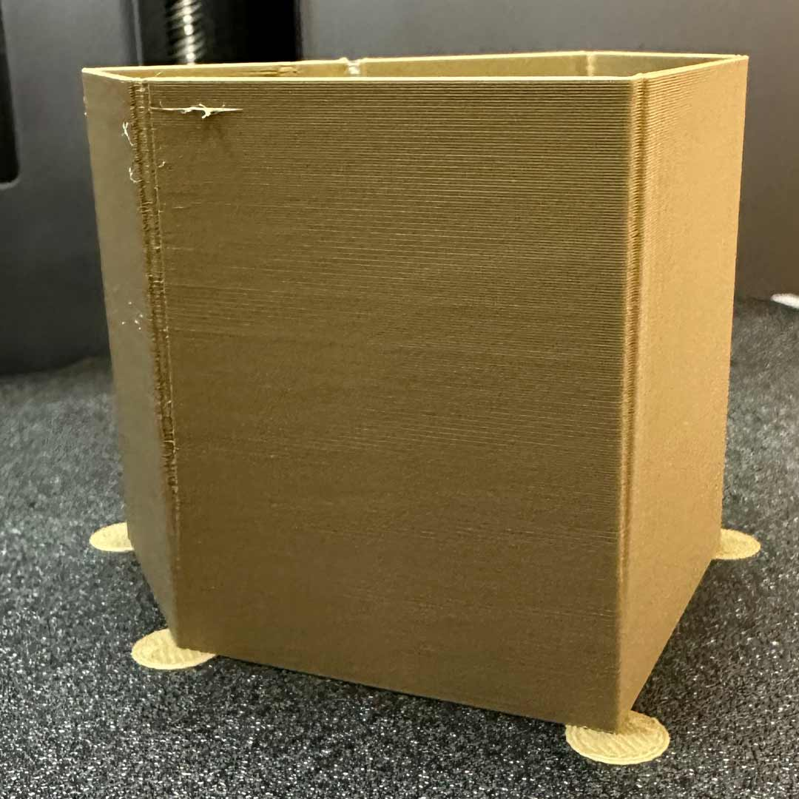
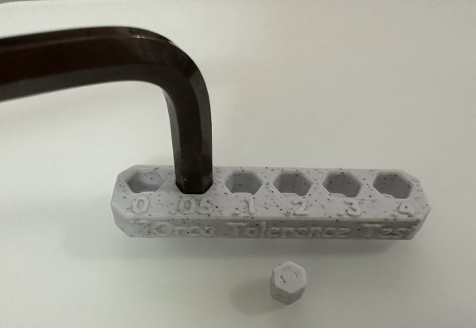
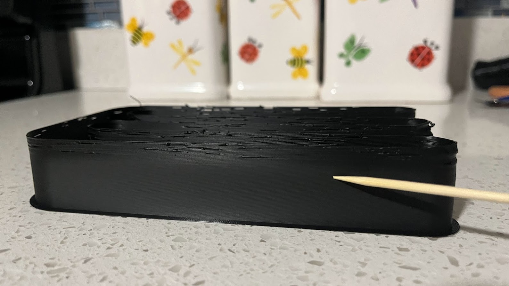
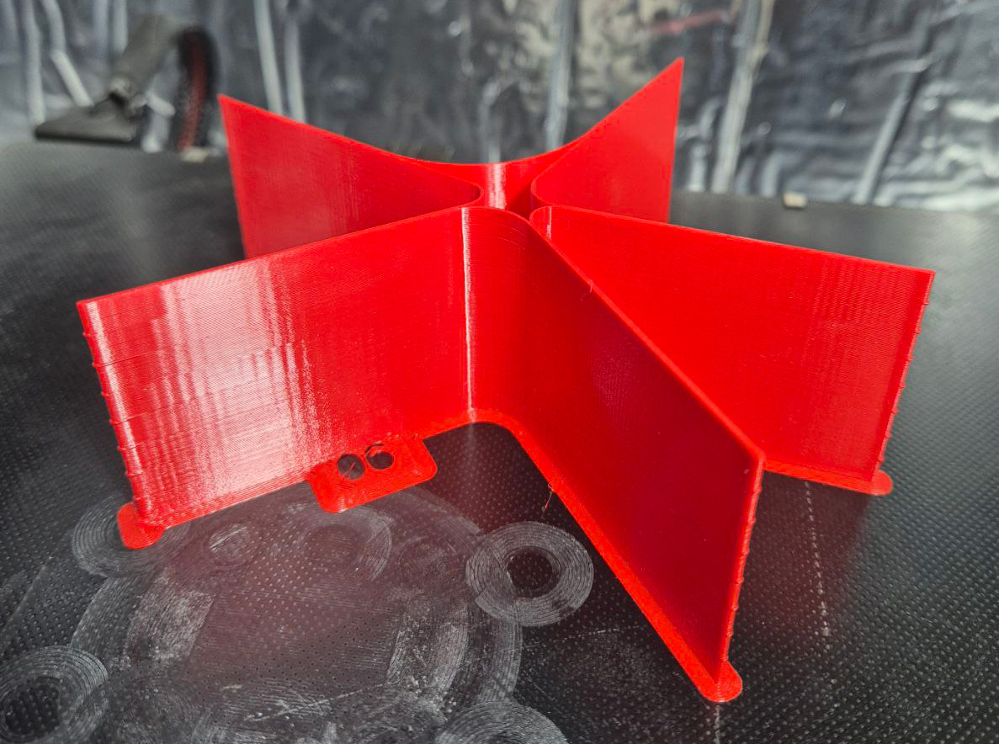

# Calibration Guide

This guide offers a structured and comprehensive overview of the calibration process for Orca Slicer.

It covers key aspects such as flow rate, pressure advance, temperature towers, retraction tests, and advanced calibration techniques. Each section includes step-by-step instructions and visuals to help you better understand and carry out each calibration effectively.

To access the calibration features, you can find them in the **Calibration** section of the Orca Slicer interface.

**Important:** After completing the calibration process, remember to create a new project in order to exit the calibration mode.

## Recommended Calibration Order

The recommended order for calibration is as follows:

### 1. Temperature
Start by calibrating the temperature of the nozzle and the bed. This is crucial as it affects the viscosity of the filament, which in turn influences how well it flows through the nozzle and adheres to the print bed.

### 2. Flow Rate
Calibrate the flow rate to ensure that the correct amount of filament is being extruded. This is important for achieving accurate dimensions and good layer adhesion.

### 3. Pressure Advance
Calibrate the pressure advance settings to improve print quality and reduce artifacts caused by pressure fluctuations in the nozzle.

- **Adaptive Pressure Advance:** This is an advanced calibration technique that can be used to further optimize the pressure advance settings for different print speeds and geometries.

### 4. Retraction
Calibrate the retraction settings to minimize stringing and improve print quality. Doing this after Flow and Pressure Advance calibration is recommended, as it ensures that the printer is already set up for optimal extrusion.

### 5. Tolerance
Calibrate the tolerances of your printer to ensure that it can accurately reproduce the dimensions of the model being printed. This is important for achieving a good fit between parts and for ensuring that the final print meets the desired specifications.

### 6. Max Volumetric Speed
Calibrate the maximum volumetric speed of the filament. This is important for ensuring that the printer can handle the flow rate of the filament without causing issues such as under-extrusion or over-extrusion.

### 7. Cornering
Calibrate the Jerk/Junction Deviation settings to improve print quality and reduce artifacts caused by sharp corners and changes in direction.

### 8. Input Shaping
This is an advanced calibration technique that can be used to reduce ringing and improve print quality by compensating for mechanical vibrations in the printer.

### 9. VFA (Vertical Fine Artifacts)
A VFA speed test is available to find resonance speeds.

## Credits

- The Flowrate test and retraction test is inspired by [SuperSlicer](https://github.com/supermerill/SuperSlicer).
- The PA Line method is inspired by [K-factor Calibration Pattern](https://marlinfw.org/tools/lin_advance/k-factor.html).
- The PA Tower method is inspired by [Klipper](https://www.klipper3d.org/Pressure_Advance.html).
- The temp tower model is remixed from [Smart compact temperature calibration tower](https://www.thingiverse.com/thing:2729076).
- The max flowrate test was inspired by Stefan (CNC Kitchen), and the model used in the test is a remix of his [Extrusion Test Structure](https://www.printables.com/model/342075-extrusion-test-structure).
- ZV Input Shaping is inspired by [Marlin Input Shaping](https://marlinfw.org/docs/features/input_shaping.html) and [Ringing Tower 3D STL](https://marlinfw.org/assets/stl/ringing_tower.stl).