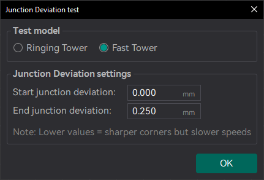
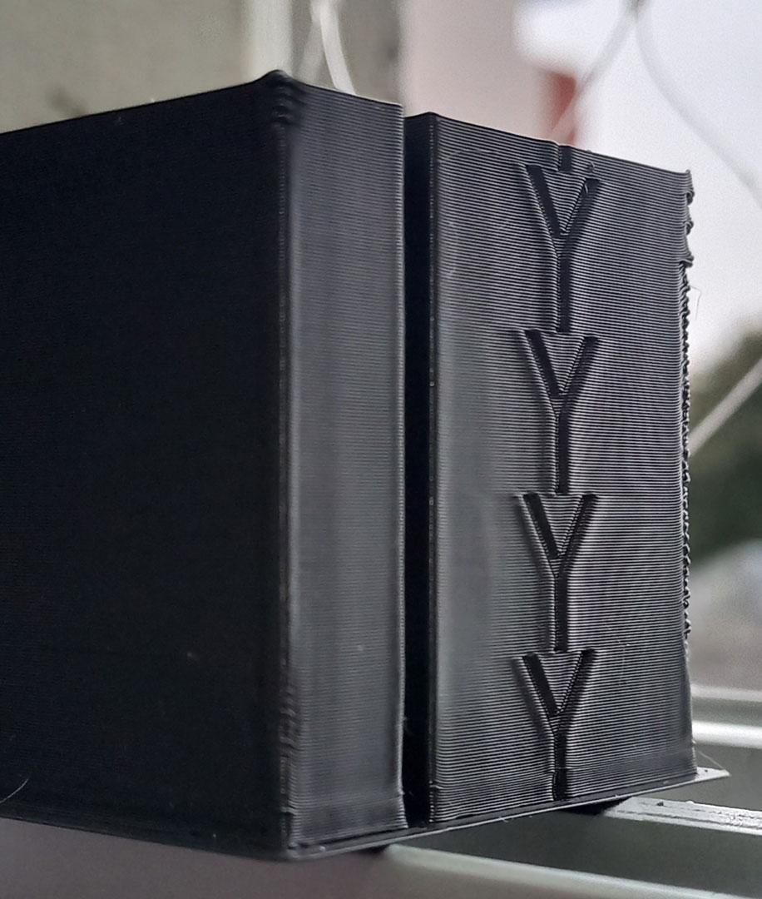
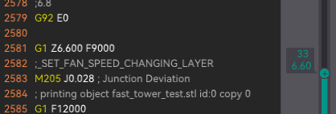
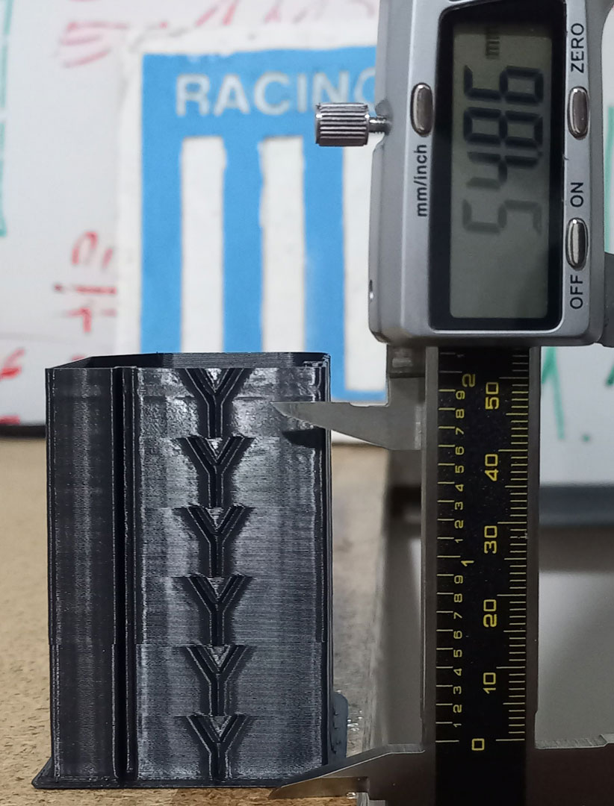
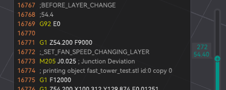
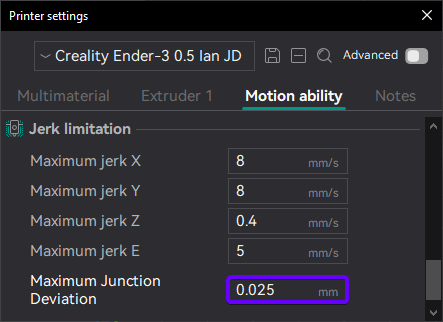

# Cornering Calibration

Cornering is a critical aspect of 3D printing that affects the quality and accuracy of prints. It refers to how the printer handles changes in direction during movement, particularly at corners and curves. Proper cornering settings can help reduce artifacts like ringing, ghosting, and overshooting, leading to cleaner and more precise prints.

## Jerk

TODO: Jerk calibration not implemented yet.

## Junction Deviation

Junction Deviation is the default method for controlling cornering speed in MarlinFW (Marlin2) printers.
Higher values result in more aggressive cornering speeds, while lower values produce smoother, more controlled cornering.
The default value in Marlin is typically set to 0.08mm, which may be too high for some printers, potentially causing ringing. Consider lowering this value to reduce ringing, but avoid setting it too low, as this could lead to excessively slow cornering speeds.

Formula: `JD = 0.4 × Jerk² / Accel`

### Calibration Process

#### Prerequisites

1. Check if your printer has Junction Deviation enabled. You can do this by sending the command `M503` to your printer and looking for the line `Junction deviation: 0.25`.

2. In OrcaSlicer, set:
   - Acceleration high enough to trigger ringing (e.g., 2000 mm/s²)
   - Speed high enough to trigger ringing (e.g., 100 mm/s)

3. Use an opaque, high-gloss filament to make the ringing more visible.

#### First Test

1. Print the Junction Deviation test.
   

2. Measure the X and Y heights and read the frequency set at that point in Orca Slicer.
   
   

#### Second Test (Fine-tuning)

1. It's very likely that you'll need to set values lower than 0.08 mm, as shown in the previous example. To determine a more accurate maximum JD value, you can print a new calibration tower with a maximum value set at the point where the corners start losing sharpness.

2. Print the second Junction Deviation test with the new maximum value.
   

3. Measure the X and Y heights and read the frequency set at that point in Orca Slicer.
   
   

### Saving the Settings

#### Option 1: Through OrcaSlicer

1. Set your Maximum Junction Deviation value in [Printer settings/Motion ability/Jerk limitation].
   

#### Option 2: Using G-code

Use the following G-code to set the Junction Deviation value:

```gcode
M205 J#JunctionDeviationValue
M500
```

Example:
```gcode
M205 J0.012
M500
```

#### Option 3: Recompile MarlinFW

1. In Configuration.h uncomment and set:
   ```c
   #define JUNCTION_DEVIATION_MM 0.012  // (mm) Distance from real junction edge
   ```

2. Check Classic Jerk is disabled (commented):
   ```c
   //#define CLASSIC_JERK
   ```