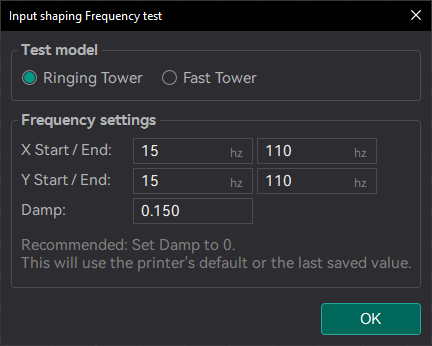
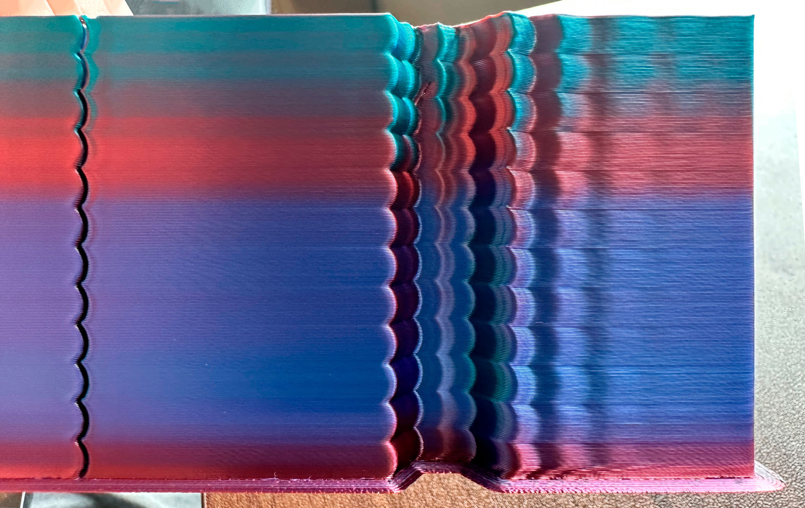
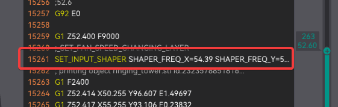
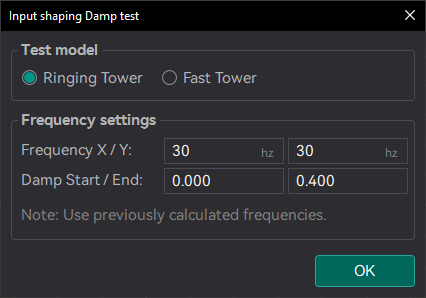
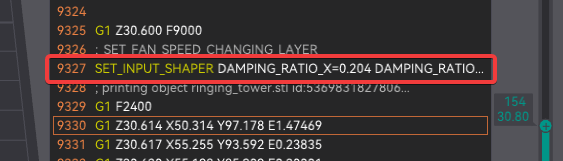
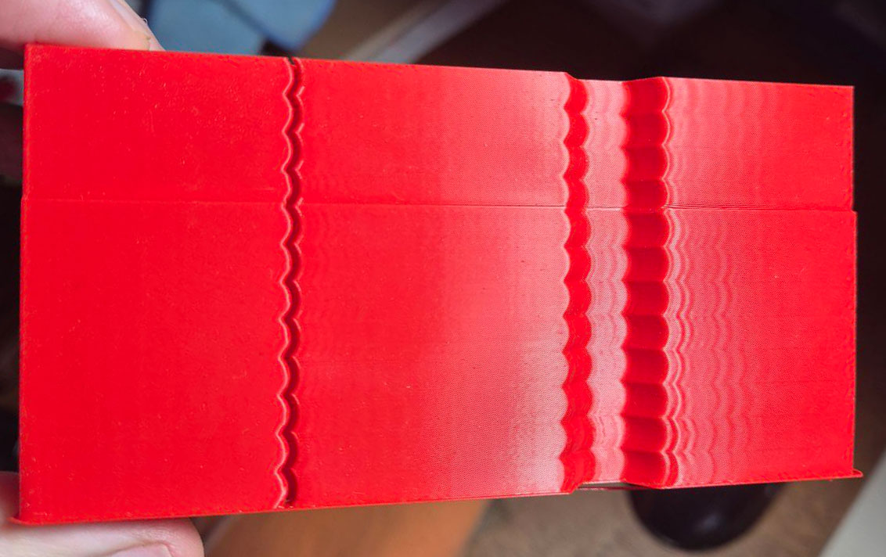
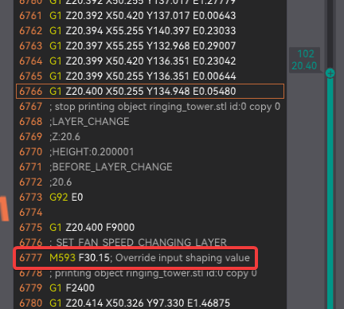
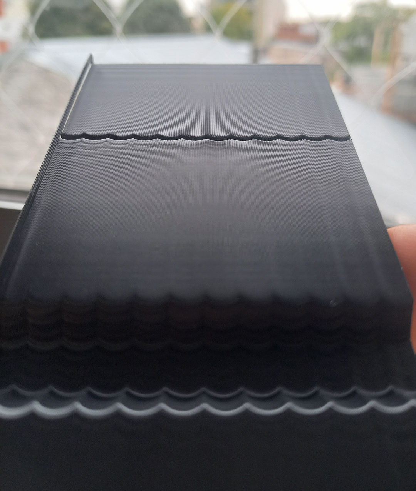
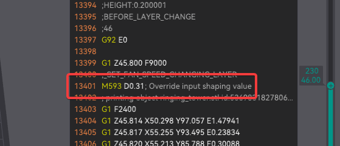

# Input Shaping Calibration

During high-speed movements, vibrations can cause a phenomenon called "ringing," where periodic ripples appear on the print surface. Input Shaping provides an effective solution by counteracting these vibrations, improving print quality and reducing wear on components without needing to significantly lower print speeds.

## Klipper - Resonance Compensation

The Klipper Resonance Compensation is a set of Input Shaping modes that can be used to reduce ringing and improve print quality. Usually the recommended values modes are `MZV` or `EI` for Delta printers.

### Prerequisites

1. In OrcaSlicer, set:
   - Acceleration high enough to trigger ringing (e.g., 2000 mm/s²)
   - Speed high enough to trigger ringing (e.g., 100 mm/s)
   
   **Note:** These settings depend on your printer's motion ability and the filament's max volumetric speed. If you can't reach speeds that cause ringing, try increasing the filament's max volumetric speed (avoid materials below 10 mm³/s).
   
   - Jerk [Klipper Square Corner Velocity](https://www.klipper3d.org/Kinematics.html?h=square+corner+velocity#look-ahead) to 5 or a high value (e.g., 20)

2. In printer settings:
   - Set the Shaper Type to `MZV` or `EI`:
     ```
     SET_INPUT_SHAPER SHAPER_TYPE=MZV
     ```
   - Disable [Minimum Cruise Ratio](https://www.klipper3d.org/Kinematics.html#minimum-cruise-ratio) with:
     ```
     SET_VELOCITY_LIMIT MINIMUM_CRUISE_RATIO=0
     ```

3. Use an opaque, high-gloss filament to make the ringing more visible.

### Frequency Test

1. Print the Input Shaping Frequency test with a range of frequencies.
   

2. Measure the X and Y heights and read the frequency set at that point in Orca Slicer.
   
   

3. If not a clear result, you can measure a X and Y min and max acceptable heights and repeat the test with that min and max value.

**Warning:** There is a chance you will need to set higher than 60Hz frequencies. Some printers with very rigid frames and excellent mechanics may exhibit frequencies exceeding 100Hz.

### Damping Test

1. Print the Damping test setting your X and Y frequency to the value you found in the previous step.
   

2. Measure the X and Y heights and read the damping set at that point in Orca Slicer.
   
   

**Important:** Not all Resonance Compensation modes support damping.

### Saving Settings

1. Restore your 3D Printer settings to avoid keep using high acceleration and jerk values.
2. Go to the printer settings and set the X and Y frequency and damp to the value you found in the previous step.

## Marlin - ZV Input Shaping

ZV Input Shaping introduces an anti-vibration signal into the stepper motion for the X and Y axes. It works by splitting the step count into two halves: the first at half the frequency and the second as an "echo," delayed by half the ringing interval. This simple approach effectively reduces vibrations, improving print quality and allowing for higher speeds.

### Prerequisites

1. In OrcaSlicer, set:
   - Acceleration high enough to trigger ringing (e.g., 2000 mm/s²)
   - Speed high enough to trigger ringing (e.g., 100 mm/s)
   
   **Note:** These settings depend on your printer's motion ability and the filament's max volumetric speed. If you can't reach speeds that cause ringing, try increasing the filament's max volumetric speed (avoid materials below 10 mm³/s).
   
   - Jerk settings:
     - If using [Classic Jerk](https://marlinfw.org/docs/configuration/configuration.html#jerk-) use a high value (e.g., 20)
     - If using [Junction Deviation](https://marlinfw.org/docs/features/junction_deviation.html) (new Marlin default mode) this test will use 0.25 (high enough to most printers)

2. Use an opaque, high-gloss filament to make the ringing more visible.

### Frequency Test

1. Print the Input Shaping Frequency test with a range of frequencies.
   

2. Measure the X and Y heights and read the frequency set at that point in Orca Slicer.
   
   

3. If not a clear result, you can measure a X and Y min and max acceptable heights and repeat the test with that min and max value.

**Warning:** There is a chance you will need to set higher than 60Hz frequencies. Some printers with very rigid frames and excellent mechanics may exhibit frequencies exceeding 100Hz.

### Damping Test

1. Print the Damping test setting your X and Y frequency to the value you found in the previous step.
   

2. Measure the X and Y heights and read the damping set at that point in Orca Slicer.
   
   

### Restoring Settings

1. Reboot your printer.
2. Use the following G-code to restore your printer settings:
   ```
   M501
   ```

### Saving Settings

1. Go to the printer settings and set the X and Y frequency and damp to the value you found in the previous step.

2. Use the following G-code to set the frequency:
   ```
   M593 X F#Xfrequency D#XDamping
   M593 Y F#Yfrequency D#YDamping
   M500
   ```

   Example:
   ```
   M593 X F37.25 D0.16
   M593 Y F37.5 D0.06
   M500
   ```

## Fixed-Time Motion

TODO: This calibration test is currently under development. See the [Marlin documentation](https://marlinfw.org/docs/gcode/M493.html) for more information.