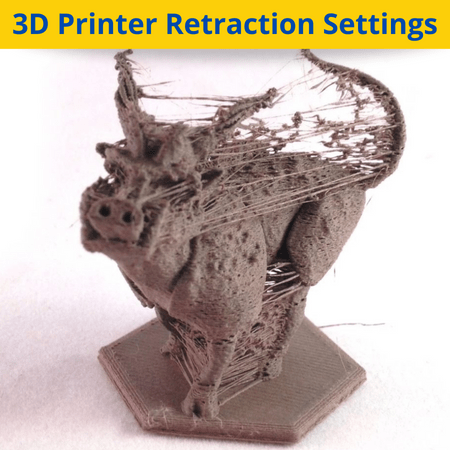
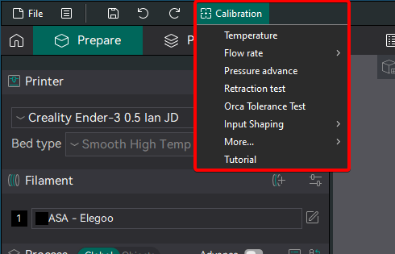
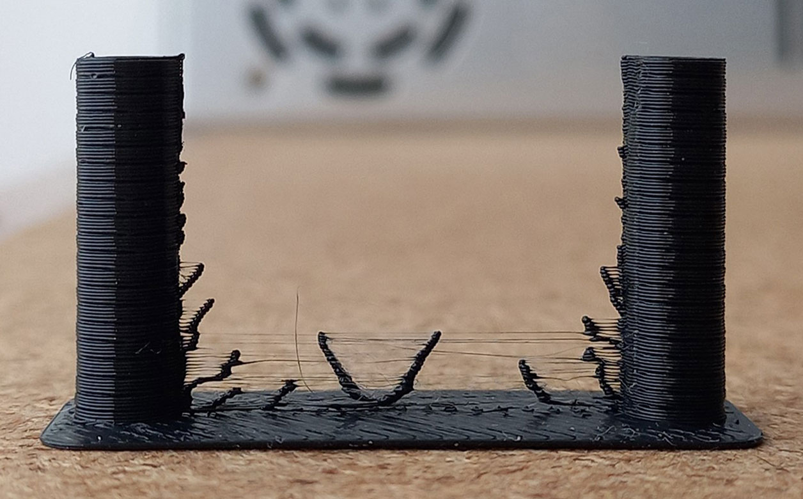
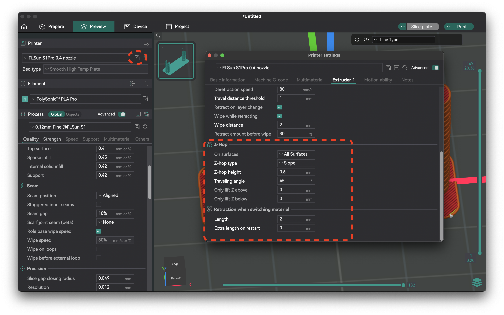

# Comprehensive 3D Printer Retraction Test Calibration Guide

## What is Retraction and Why It Matters

### Understanding Retraction
Retraction is a fundamental 3D printing feature that instructs the extruder to pull back a specific amount of filament before performing a travel move. This creates negative pressure inside the nozzle, effectively reducing the flow of molten plastic and preventing excess material from leaking out during non-printing movements.

**The Physics Behind Retraction**: When the hotend moves across the print without extruding, the molten filament in the nozzle chamber tends to ooze out due to gravity and residual pressure. By pulling the filament back, we create a vacuum effect that counteracts this unwanted flow.

### Common Print Quality Issues Without Proper Retraction

Without properly calibrated retraction, you'll encounter several print quality issues:

#### **Stringing** 
Fine threads of filament stretched between different parts of your print. This is the most visible and common issue caused by insufficient retraction.

*Example of stringing issues - Higher retraction speeds generally reduce stringing by quickly pulling the filament away from the heat zone*

#### **Oozing**
Excess material leaking from the nozzle during travel moves, creating unwanted deposits on your print surface.

#### **Blobs and Zits**
Small bumps or imperfections on print surfaces where the nozzle paused or changed direction, caused by pressure buildup in the hotend.

#### **Poor Surface Finish**
Irregular textures and artifacts that make your prints look unprofessional and may affect dimensional accuracy.

### The Relationship Between Issues and Retraction Settings

Understanding how retraction parameters affect these issues is crucial:

1. **Retraction Distance** directly impacts:
   - Stringing severity (insufficient distance = more strings)
   - Oozing control (too little = material continues to flow)
   - Print quality after travel moves

2. **Retraction Speed** influences:
   - How quickly filament is pulled from the melt zone
   - The effectiveness of pressure relief
   - Potential for filament grinding (too fast can damage filament)

3. **Temperature** interacts with retraction:
   - Higher temps = more fluid material = need for more retraction
   - Lower temps = less oozing but potential for clogs
   - Must be optimized before retraction calibration

Proper retraction settings achieve **cleaner prints**, **smoother surfaces**, and **professional-quality results** without compromising print time or material usage.

## Step-by-Step Retraction Calibration Process

### Prerequisites
Before starting retraction calibration, ensure you've completed:
1. Temperature calibration for your filament
2. Flow rate/extrusion multiplier calibration
3. Filament is properly dried (moisture causes unfixable stringing)

### Step 1: Access OrcaSlicer's Retraction Test

Open OrcaSlicer and navigate to the calibration menu:
1. Create a new project
2. Select **Calibration** from the top menu
3. Click on **"Retraction Test"**
4. The retraction tower settings window will open

### Step 2: Configure Test Parameters

The retraction test uses a tower model with multiple sections, each testing different retraction values. Configure three key parameters:

- **Start retraction length**: The minimum value to test
- **End retraction length**: The maximum value to test  
- **Step**: The increment between each test section

### Step 3: Set Values Based on Your Extruder Type

This is where proper test ranges become crucial. Use these ranges for calibration:

#### Direct Drive Extruders
- **Start**: 0mm
- **End**: 2mm
- **Step**: 0.1mm
- **Reason**: Short filament path requires minimal retraction

#### Bowden Extruders
- **Start**: 1mm
- **End**: 6mm
- **Step**: 0.2mm
- **Reason**: Long tube between extruder and nozzle needs higher values

### Step 4: Pre-Test Configuration

Before printing, optimize these settings for accurate results:

#### Essential Settings for Accurate Testing

1. **Z-hop Type Configuration**
   - Navigate to **Printer Settings** > **Extruder** tab
   - Set **Z hop type** to "Normal"
   - This ensures consistent vertical movement during testing
   - Avoid Slope, Spiral, or Auto modes as they can affect test accuracy

2. **Seam Position Alignment**
   - In the print settings, set **Seam position** to "Aligned"
   - This ensures travel moves occur directly between the two towers
   - Critical for consistent stringing patterns

3. **Verify Travel Motion Path**
   - After slicing, check the preview
   - Look for blue lines (travel moves) between tower sections
   - Travel should move directly between the towers, not around them

#### Manual Seam Painting (If Needed)

If travel motions aren't properly aligned:

1. **Access Seam Painting Tool**
   - Select the retraction tower model
   - Choose "Seam painting" from the floating horizontal menu

2. **Paint Seam Locations**
   - Paint vertical seams on the inner faces of each tower
   - Ensure seams are opposite each other
   - This forces travel moves to go directly between towers

3. **Verify Results**
   - Slice the model again
   - Confirm blue travel lines now connect the towers directly
   - This ensures each retraction test is performed consistently

### Step 5: Print and Analyze

1. Slice and print the retraction tower
2. Each notch represents a different retraction value
3. The tower increments from bottom (start value) to top (end value)
4. Look for the **lowest section with minimal stringing**

### Step 6: Calculate Optimal Value

To determine your optimal retraction length:
1. Examine your printed tower and identify the cleanest section with minimal stringing
2. Measure the height from the base to this optimal section using calipers
3. Calculate: **(Height × Step Size) + Start Value = Optimal Retraction**
4. Example: If the cleanest section is at 10mm height, with 0.1mm steps and 0mm start value:
   - Calculation: (10mm × 0.1) + 0 = 1.0mm optimal retraction

### Step 7: Apply Settings in OrcaSlicer (Critical Step)

This step is crucial for implementing your calibration results. Follow these exact steps to update your retraction settings:

1. **Open Filament Settings**
   - Click the small gear/settings icon next to your filament selection
   - This opens the filament configuration window

2. **Navigate to Settings Overrides Tab**
   - Look for the "Settings overrides" tab in the filament settings window
   - This tab allows you to override printer settings for specific filaments

3. **Enable Retraction Length Override**
   - Find the "Retraction" section
   - Check the box next to "Length" to enable the override
   - This tells OrcaSlicer to use your custom value instead of the printer default

4. **Input Your Optimal Value**
   - Enter the retraction length you calculated in Step 6
   - Be precise - use the exact value from your calculation

5. **Save the Profile**
   - Click the save icon (usually a disk icon) to save your changes
   - Give your profile a descriptive name if creating a new one
   - Example: "PLA - Brand Name - Calibrated"

*The Settings Overrides tab in filament settings - Check the "Length" box and enter your calibrated value*

**Important**: This override will now apply whenever you select this filament profile, ensuring consistent results across all your prints with this material.

## Retraction Test Range Recommendations

### Important Distinction
The following are **TEST RANGES** for calibration - NOT final optimal values. These ranges help you discover the best settings for your specific setup.

### Direct Drive Test Ranges

| Material | Start | End | Step | Speed | Notes |
|----------|-------|-----|------|-------|-------|
| **PLA** | 0mm | 2mm | 0.1mm | 30-40mm/s | Most common, rarely needs >1mm |
| **ABS** | 0mm | 2mm | 0.1mm | 30-40mm/s | Similar to PLA behavior |
| **PETG** | 0mm | 2mm | 0.1mm | 30-40mm/s | May need higher values due to oozing |
| **TPU** | 0mm | 1mm | 0.1mm | 10-20mm/s | Minimal retraction to avoid jams |
| **Nylon** | 0mm | 1.5mm | 0.1mm | 25-35mm/s | Lower retraction typically needed |
| **PC** | 0mm | 2mm | 0.1mm | 30-40mm/s | Similar to ABS |
| **ASA** | 0mm | 2mm | 0.1mm | 30-40mm/s | Similar to ABS |

### Bowden Test Ranges

| Material | Start | End | Step | Speed | Notes |
|----------|-------|-----|------|-------|-------|
| **PLA** | 1mm | 6mm | 0.2mm | 40-50mm/s | Typically optimal at 3-5mm |
| **ABS** | 1mm | 6mm | 0.2mm | 40-50mm/s | May need up to 7mm for long tubes |
| **PETG** | 1mm | 7mm | 0.2mm | 40-50mm/s | Often needs higher values |
| **TPU** | 0.5mm | 3mm | 0.2mm | 20-30mm/s | Difficult with Bowden, use rigid TPU |
| **Nylon** | 1mm | 5mm | 0.2mm | 30-40mm/s | Lower than other materials |
| **PC** | 1mm | 6mm | 0.2mm | 40-50mm/s | Similar to ABS |
| **ASA** | 1mm | 6mm | 0.2mm | 40-50mm/s | Similar to ABS |

### Understanding Test vs. Final Values

**Example**: For PLA with Direct Drive:
- **Test Range**: 0mm to 2mm in 0.1mm increments
- **Typical Optimal Result**: 0.4-0.8mm
- **Process**: Test finds the minimum effective value within the range

## What to Look for in Test Results

### Analyzing Your Retraction Tower

**Visual Inspection Criteria**:
1. **Minimal Stringing**: Look for the cleanest section with least visible threads
2. **Surface Quality**: Ensure no degradation in layer adhesion or finish
3. **Consistency**: Results should be repeatable across the section
4. **Balance**: Choose the **shortest retraction** that achieves clean results

### Common Patterns to Recognize

- **Under-retraction**: Visible stringing between posts, oozing on travels
- **Optimal retraction**: Clean gaps, no strings, good surface quality
- **Over-retraction**: May cause gaps, poor layer adhesion, or grinding

## Retraction Speed Recommendations

### Speed Guidelines by Setup

**Direct Drive Systems**:
- Standard Range: 40-60mm/s
- TPU/Flexible: 10-20mm/s
- High-Speed Printing: Up to 70mm/s

**Bowden Systems**:
- Standard Range: 30-50mm/s
- Long Tubes (>50cm): 25-40mm/s
- High-Performance: 50-60mm/s

### Material-Specific Speed Considerations

- **PLA/ABS/ASA**: Use standard ranges
- **PETG**: Slightly slower (30-40mm/s) to prevent stringing
- **TPU**: Always use slowest speeds (10-20mm/s)
- **Nylon/PC**: Medium speeds (25-35mm/s)

## Common Issues and Troubleshooting

### Persistent Stringing After Calibration

**Problem**: Stringing continues despite optimal retraction settings

**Solutions**:
1. **Dry your filament** - Moisture is the #1 cause of unfixable stringing
2. **Check nozzle installation** - Loose nozzles cause persistent oozing
3. **Lower printing temperature** - Try reducing by 5-10°C
4. **Increase travel speed** - Faster moves = less time to ooze
5. **Verify extruder calibration** - E-steps must be correct

### Under-Extrusion After Travel

**Problem**: Gaps or weak spots after retraction moves

**Solutions**:
1. Reduce retraction distance slightly
2. Enable "Extra Length on Restart" (0.1-0.2mm)
3. Check for filament grinding
4. Ensure proper extruder tension

### Temperature-Related Issues

**Too Hot**:
- Excessive stringing regardless of retraction
- Poor surface finish
- Solution: Perform temperature tower first

**Too Cold**:
- Poor layer adhesion
- Under-extrusion
- Solution: Increase temperature before retraction tuning

### Material-Specific Troubleshooting

**PETG Specific**:
- Prone to stringing even with good retraction
- Try: Lower temperature, faster travel, minimal Z-hop
- Consider coasting settings

**TPU/Flexible**:
- Avoid excessive retraction (causes jams)
- Focus on temperature optimization
- Direct drive strongly recommended

**High-Temperature Materials (PC, Nylon)**:
- May need enclosed printer
- Consistent chamber temperature critical
- Dry storage essential

## Understanding All Retraction Settings in OrcaSlicer

When you open your printer settings to access the retraction section, you'll find numerous options. Here's what each one does:

### Core Retraction Parameters

1. **Retraction Length**
   - The amount of filament (in mm) pulled back to prevent oozing
   - This is what you're calibrating with the retraction test
   - Set to 0 to disable retraction completely

2. **Extra Length on Restart**
   - Additional filament pushed after a retraction move
   - Compensates for any material lost during retraction
   - Rarely needed; typically 0-0.2mm if required

3. **Retraction Speed**
   - How fast the filament is pulled back (mm/s)
   - Higher speeds generally reduce stringing
   - Too fast can cause grinding or skipping

4. **Deretraction Speed**
   - Speed for pushing filament back after retraction
   - Set to 0 to match retraction speed
   - Sometimes slower speeds help with consistency

### Travel and Movement Settings

5. **Travel Distance Threshold**
   - Minimum travel distance before retraction activates
   - Prevents excessive retractions on short moves
   - Typically 1-2mm for most printers

6. **Retract on Layer Change**
   - Pulls filament back before moving to next layer
   - Helps prevent stringing between layers
   - Usually enabled for best results

### Advanced Features

7. **Wipe While Retracting**
   - Nozzle moves along previous path during retraction
   - Helps clean nozzle tip
   - Reduces blob formation

8. **Wipe Distance**
   - How far the nozzle travels during wipe
   - Typically 1-2mm
   - Longer distances may improve seam quality

9. **Retract Amount Before Wipe**
   - Percentage of retraction completed before wiping starts
   - Default 0% (wipe during entire retraction)
   - Adjust if experiencing Z-seam issues

## Advanced Retraction Settings

### Z-Hop Configuration

Z-hop is a feature that lifts the nozzle slightly when performing travel moves, preventing it from dragging across printed surfaces. This is especially important during retraction calibration.

*Location of Z-hop settings in Printer Settings > Extruder tab*

**Z-Hop Types Explained**:
- **Normal**: Straight vertical lift - safest, recommended for testing
  - Nozzle moves straight up and down
  - Most predictable behavior
  - Best for retraction calibration
  
- **Slope**: Diagonal movement - faster but collision risk
  - Nozzle moves diagonally during lift
  - Reduces travel time
  - Risk of hitting overhangs or warped sections
  
- **Spiral**: Circular lift pattern - slowest but smoothest
  - Nozzle spirals up and down
  - Minimizes stringing and blobs
  - Longer travel time
  
- **Auto**: Software selects based on geometry
  - OrcaSlicer chooses the best method
  - Considers obstacles and print geometry
  - Not recommended during calibration

**When to Use Z-Hop**:
- Models with many travel moves across printed areas
- Prints with delicate features
- When nozzle dragging occurs
- Testing retraction settings (use "Normal" type)

**Configuring Z-Hop for Retraction Testing**:
1. Go to **Printer Settings** > **Extruder** tab
2. Find the **Retraction** section
3. Set **Z hop type** to "Normal"
4. Set **Z hop when retracting** to 0.2-0.4mm
5. This ensures consistent test results

### Wipe Settings

**Wipe While Retracting**: Moves nozzle along previous path during retraction
- Helps clean nozzle tip
- Reduces blob formation
- Typical distance: 1-2mm

**Retract Amount Before Wipe**: Percentage of retraction before wiping starts
- Default: 0% (wipe during entire retraction)
- Adjust for Z-seam quality issues

### Integration with Other Features

**Pressure Advance/Linear Advance**:
- Significantly reduces retraction needs
- Calibrate PA/LA before retraction
- May reduce required retraction by 50%

**Coasting**:
- Alternative to retraction for some materials
- Stops extrusion before travel
- Useful for PETG and similar materials

## Calibration Order and Best Practices

### Recommended Calibration Sequence

1. **Temperature Calibration** - Foundation for all other settings
2. **Flow Rate Calibration** - Ensures accurate extrusion
3. **Pressure Advance** - Reduces retraction requirements
4. **Retraction Calibration** - Fine-tune after above steps
5. **Tolerance/Dimensional Calibration** - Final accuracy tuning

### Best Practices Summary

1. **Start Conservative**: Use minimum effective retraction
2. **Test Systematically**: Change one variable at a time
3. **Document Settings**: Save profiles for each filament
4. **Regular Maintenance**: Retraction needs may change with wear
5. **Material Storage**: Keep filament dry for consistent results
6. **Hardware Checks**: Ensure tight fittings and clean nozzle

### Creating Filament Profiles

After calibration:
1. Save settings in filament-specific profiles
2. Include temperature, flow, and retraction values
3. Note ambient conditions during testing
4. Update profiles as needed

## Key Takeaways: Mastering Retraction Calibration

### Understanding the Cause-and-Effect Relationships

Successful retraction calibration requires understanding how different issues relate to your settings:

**If You See Stringing:**
- First check: Is retraction distance sufficient?
- Second check: Is retraction speed too slow?
- Third check: Is temperature too high?
- Remember: Wet filament will string regardless of settings

**If You See Oozing or Blobs:**
- Usually indicates insufficient retraction distance
- May need to enable Z-hop to prevent nozzle dragging
- Consider reducing temperature if within acceptable range

**If You See Under-extrusion After Travel:**
- Retraction distance may be too high
- Check for filament grinding (reduce retraction speed)
- Consider enabling "Extra Length on Restart"

### The Calibration Success Formula

1. **Temperature First** → Sets the baseline for material flow
2. **Flow Rate Second** → Ensures accurate extrusion
3. **Pressure Advance Third** → Reduces retraction requirements
4. **Retraction Fourth** → Fine-tunes remaining issues
5. **Document Everything** → Save profiles for each filament

### Critical Points to Remember

- **Test Ranges ≠ Final Values**: The ranges in this guide are for finding your optimal settings
- **Minimum Effective Retraction**: Always use the shortest distance that works
- **Material Matters**: Each filament type and brand needs individual calibration
- **Environmental Factors**: Humidity affects results - keep filament dry
- **Hardware Condition**: Worn nozzles or loose fittings invalidate calibration

## Conclusion

Proper retraction calibration transforms print quality by eliminating stringing and oozing while maintaining print integrity. The relationship between temperature, flow, pressure, and retraction creates a system where each element affects the others. By understanding these relationships and following systematic testing procedures, you'll achieve consistently excellent results.

Remember that retraction calibration is not a one-time process. As your printer wears, as you change materials, or as environmental conditions shift, you may need to recalibrate. The investment in proper calibration pays dividends in reduced failed prints, less post-processing, and professional-quality results.

Through systematic testing using OrcaSlicer's built-in tools and following this comprehensive guide, you now have the knowledge to diagnose issues, understand their root causes, and apply the correct solutions. Master these concepts, and you'll significantly elevate your 3D printing capabilities.